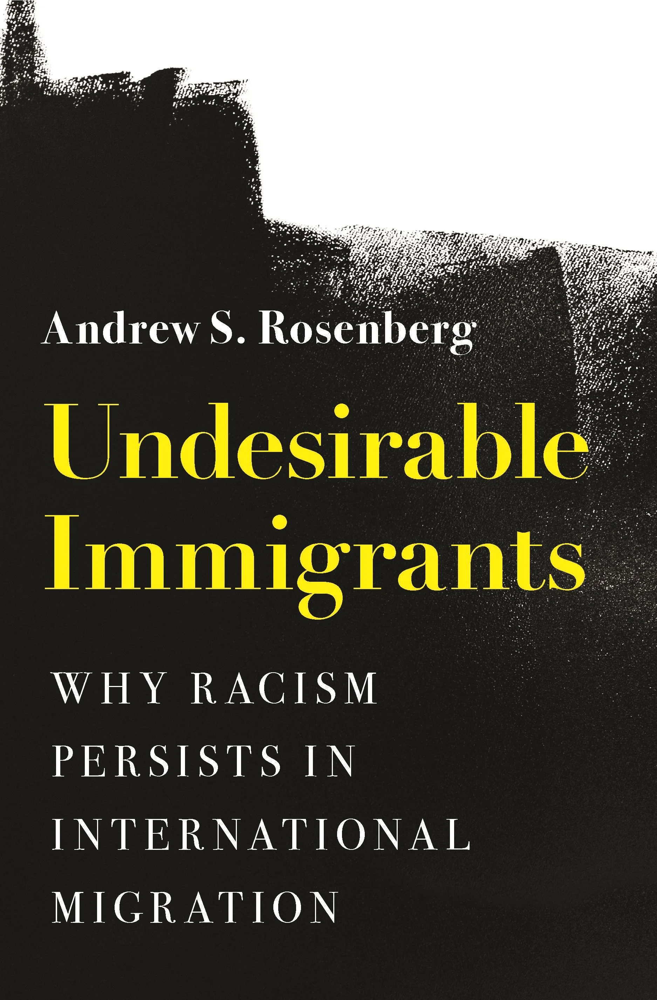

::: {.book-page}
{.book-cover-img fig-alt="Undesirable Immigrants book cover"}

::: {.book-body}

*Undesirable Immigrants: Why Racism Persists in International Migration* (Princeton University Press, 2022). International History and Politics series.

Available [HERE](https://press.princeton.edu/books/hardcover/9780691238739/undesirable-immigrants).

My first book, *Undesirable Immigrants*, was published by Princeton University Press in its International History and Politics series in August 2022. It was recently profiled in [*Mother Jones*](https://www.motherjones.com/politics/2022/08/the-chinese-exclusion-act-may-be-in-the-past-but-racism-still-drives-most-immigration-policies/), and I spoke about it on the New Books in Political Science [podcast](https://newbooksnetwork.com/undesirable-immigrants).

The book reveals the persistence of racial bias in international migration despite the end of explicitly discriminatory policies. It argues that while today's leaders claim that their policies are objective and seek only to restrict obviously dangerous migrants, these policies are still correlated with race. The analysis demonstrates that we cannot address the challenges of international migration without coming to terms with the brutal history of colonialism.

> **2023 Best Book Award**, Race, Ethnicity, and Politics section, American Political Science Association.

## Endorsements

> "*Undesirable Immigrants* reveals how racially neutral migration policies yield racially biased policy outcomes and traces the roots of the problem to legacies of colonization and imperialism. Rosenberg is clear-eyed in exhorting the international community to look beneath the veneer of legal colorblindness."
>
> — **Nazli Avdan**, University of Kansas

> "Rosenberg's historical analysis pierces the illusion that state sovereignty is predicated on immigration control. A novel statistical method then shows that the effects of these controls around the world is to discriminate by race, regardless of the intent of individual policymakers. These tightly argued provocations are certain to stir debate."
>
> — **David Scott FitzGerald**, University of California, San Diego

> "Timely and provocative."
>
> — **Errol A. Henderson**, Penn State University

> "Rosenberg's pathbreaking and compelling book demonstrates the unassailable fact of inequality in the migration policies of states."
>
> — **Robert Vitalis**, University of Pennsylvania

:::
:::
