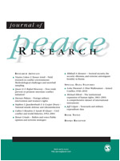
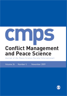
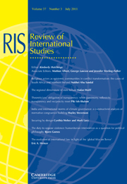
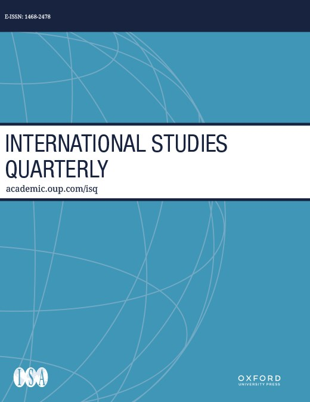
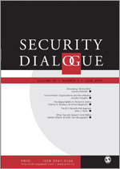
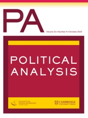

::: {.pub-entry}
{.pub-cover-img fig-alt="Journal of Peace Research cover"}

::: {.pub-body}
[Where There's a Will, There's a Way: Border Walls and Refugees]{.pub-title}\
[with Nazli Avdan and Christopher F. Gelpi. *Journal of Peace Research*, Vol. 62, Iss. 2, March 2025, pp. 375–389.]{.pub-venue}

```{=html}
<div class="pub-links"><details class="abs-toggle"><summary>Abstract</summary></details><a href="assets/papers/walls-refugees.pdf">PDF</a><a href="https://doi.org/10.1177/00223433231200918">DOI</a><details class="bib-toggle"><summary>BibTeX</summary></details><a href="https://asrosenberg.com/s/fences-replication.zip">Replication</a><div class="abs-panel">Over the last decade, there has been a notable surge in the movement of refugees across international borders, posing significant challenges for the international community. In response, various policy measures have been implemented, including the construction of border walls, with the aim of impeding refugee influx. However, scholars have expressed doubts regarding the effectiveness of these fortifications, suggesting that walls merely redirect migrants to alternative routes, discourage return migration, or alter migrants' cost–benefit calculations. Despite these concerns, there has been a lack of rigorous testing to support or refute these claims beyond case-specific evidence. This article addresses this gap by thoroughly examining the arguments surrounding the impact of border fencing on refugee flows. We conduct a systematic, cross-national test with a two-way fixed-effects estimator, an equivalence test, and a recently developed matching estimator for time-series cross-sectional data. Our results strongly support those who are skeptical of the impact of walls: border fencing has not had any causal impact on refugee flows between 1970 and 2017, or the statistical state-of-the-art is incapable of discerning that true effect. While walls may serve as politically attractive tools for populist leaders, their actual deterrent effects are highly questionable at best.</div><div class="bib-panel"><pre><code>@article{avdan2023walls,
  author  = {Nazli Avdan and Andrew S. Rosenberg and Christopher F. Gelpi},
  title   = {Where There's a Will, There's a Way: Border Walls and Refugees},
  journal = {Journal of Peace Research},
  volume  = {62},
  number  = {2},
  pages   = {375--389},
  year    = {2025},
  doi     = {10.1177/00223433231200918},
}</code></pre></div></div>
```
:::
:::

::: {.pub-entry}
{.pub-cover-img fig-alt="Conflict Management and Peace Science cover"}

::: {.pub-body}
[Assessing Border Walls' Varied Impacts on Terrorist Group Diffusion]{.pub-title}\
[with Nazli Avdan. *Conflict Management and Peace Science*, Vol. 42, Iss. 4, September 2024, pp. 438–461.]{.pub-venue}

```{=html}
<div class="pub-links"><details class="abs-toggle"><summary>Abstract</summary></details><a href="assets/papers/fences-violence.pdf">PDF</a><a href="https://doi.org/10.1177/07388942241270927">DOI</a><details class="bib-toggle"><summary>BibTeX</summary></details><div class="abs-panel">Do border walls inhibit the spread of transnational terrorism? Previous research has primarily measured the volume of terrorism without explicitly modeling its diffusion or considering how walls might affect different groups differently. To address these oversights, the study adopts a network-based approach, analyzing the impact of border walls on the spread of violence among 63 extremist organizations from 1970 to 2017. The findings show that barriers generally inhibit diffusion, but their effectiveness varies significantly among groups. This research challenges policymakers who regard walls as a catch-all solution for terrorism, offering a fresh perspective on whether walls' effects justify their cost.</div><div class="bib-panel"><pre><code>@article{Rosenberg_Avdan_2024,
  author  = {Andrew S. Rosenberg and Nazli Avdan},
  title   = {Assessing Border Walls' Varied Impacts on Terrorist Group Diffusion},
  journal = {Conflict Management and Peace Science},
  volume  = {42},
  number  = {4},
  pages   = {438--461},
  year    = {2024},
  doi     = {10.1177/07388942241270927},
}</code></pre></div></div>
```
:::
:::

::: {.pub-entry}
{.pub-cover-img fig-alt="Review of International Studies cover"}

::: {.pub-body}
[Race and Systemic Crises in International Politics: An Agenda for Pluralistic Scholarship]{.pub-title}\
[*Review of International Studies*, Vol. 50, Iss. 3, January 2024, pp. 457–475.]{.pub-venue}

```{=html}
<div class="pub-links"><details class="abs-toggle"><summary>Abstract</summary></details><a href="assets/papers/race-systemic-crises.pdf">PDF</a><a href="https://doi.org/10.1017/S0260210523000761">DOI</a><details class="bib-toggle"><summary>BibTeX</summary></details><div class="abs-panel">In recent years, scholars of global politics have shown that issues of race and white supremacy lie at the centre of international history, the birth of the field of International Relations, and contemporary theory. In this article, I argue that race plays an equally central role in the 21st century's current and future crises: the set of systemic risks that includes intensifying climate change, deepening inequality, the endemic instabilities of capitalism, and migration. To make this argument, I describe the contours of the current crisis and show how racism amplifies its effects. In short, capitalism's winners and losers and the effects of climate change fall along racial lines, amplifying both direct and indirect racial discrimination against non-white migrants and states in the Global South. These interdependent crises will shape the next 50 years of international politics and will likely perpetuate the vicious cycle of global racial inequality. Accordingly, this article presents a research agenda for all IR scholars to explore the empirical implications of race in the international system, integrate marginalised perspectives on global politics from the past and present into their scholarship, and address the most pressing political issues of the 21st century.</div><div class="bib-panel"><pre><code>@article{Rosenberg_2024,
  author  = {Rosenberg, Andrew S.},
  title   = {Race and Systemic Crises in International Politics: An Agenda for Pluralistic Scholarship},
  journal = {Review of International Studies},
  volume  = {50},
  number  = {3},
  pages   = {457--475},
  year    = {2024},
  doi     = {10.1017/S0260210523000761},
}</code></pre></div></div>
```
:::
:::

::: {.pub-entry}
{.pub-cover-img fig-alt="International Studies Quarterly cover"}

::: {.pub-body}
[Racial Discrimination in International Visa Policies]{.pub-title}\
[*International Studies Quarterly*, Vol. 67, Iss. 2, March 2023, sqad032.]{.pub-venue}

```{=html}
<div class="pub-links"><details class="abs-toggle"><summary>Abstract</summary></details><a href="assets/papers/visa-waivers.pdf">PDF</a><a href="https://doi.org/10.1093/isq/sqad032">DOI</a><details class="bib-toggle"><summary>BibTeX</summary></details><a href="https://academic.oup.com/isq/article/67/2/sqad032/7160629#supplementary-data">Replication</a><div class="abs-panel">Does racial discrimination persist in global mobility rights? While many states explicitly discriminated based on race far into the twentieth century, contemporary migration policymaking is now putatively objective. The rise of white supremacist violence against all varieties of migrants, politician statements, and public support for restrictive policies calls this supposed color blindness into question. However, existing work is not discerning because most policies appear objective. In this article, I use new data on bilateral visa waiver policies from 1973 to 2013 to show that racial difference predicts whether a country receives a visa waiver, even after accounting for its economic, political, and security context. This conditional racial discrimination has worsened since 9/11. In so doing, I provide evidence of systematic racial discrimination in international visa policymaking. The results have important implications for the study of racial inequality in the international system.</div><div class="bib-panel"><pre><code>@article{rosenberg2023visa,
  author  = {Rosenberg, Andrew S.},
  title   = {Racial Discrimination in International Visa Policies},
  journal = {International Studies Quarterly},
  volume  = {67},
  number  = {2},
  pages   = {sqad032},
  year    = {2023},
  doi     = {10.1093/isq/sqad032},
}</code></pre></div></div>
```
:::
:::

::: {.pub-entry}
{.pub-cover-img fig-alt="Security Dialogue cover"}

::: {.pub-body}
[Agents, Structures, and the Moral Basis of Deportability]{.pub-title}\
[*Security Dialogue*, Vol. 54, Iss. 6, August 2022, pp. 602–619.]{.pub-venue}

```{=html}
<div class="pub-links"><details class="abs-toggle"><summary>Abstract</summary></details><a href="assets/papers/deportability.pdf">PDF</a><a href="https://doi.org/10.1177/09670106221113183">DOI</a><details class="bib-toggle"><summary>BibTeX</summary></details><div class="abs-panel">Deportability is the omnipresent possibility of deportation, which gives rise to constant fear among migrants. In this article, I argue that a focus on deportability's structural causes — such as global capitalism — obscures how the agency of state leaders and citizens produces policies that entrench this vulnerability and fear. Many in the West believe that the precarity of deportability is what migrants deserve because they are unsuitable for membership in the political community. These people are not scared of migrants. They just believe that the latter do not deserve to reap the benefits of living in their state, even if they contribute their fair share. Therefore, leaders will constantly have an incentive to securitize migrants and enact deportability-enhancing policies because the public will acquiesce. To mitigate deportability, states must cultivate a broader sense of cosmopolitan empathy about those from outside the political community. For if citizens cannot see migrants as worthy of aid or participation in their political community, they will remain susceptible to policies that reinforce deportability.</div><div class="bib-panel"><pre><code>@article{rosenberg2022agents,
  author  = {Rosenberg, Andrew S.},
  title   = {Agents, Structures, and the Moral Basis of Deportability},
  journal = {Security Dialogue},
  volume  = {54},
  number  = {6},
  pages   = {602--619},
  year    = {2022},
  doi     = {10.1177/09670106221113183},
}</code></pre></div></div>
```
:::
:::

::: {.pub-entry}
{.pub-cover-img fig-alt="American Journal of Political Science cover"}

::: {.pub-body}
[Democratization and Representative Bureaucracy: An Analysis of Promotion Patterns in Indonesia's Civil Service, 1980–2015]{.pub-title}\
[with Jan H. Pierskalla, Adam Lauretig, and Audrey Sacks. *American Journal of Political Science*, Vol. 65, Iss. 2, April 2021, pp. 261–277.]{.pub-venue}

```{=html}
<div class="pub-links"><details class="abs-toggle"><summary>Abstract</summary></details><a href="assets/papers/indonesia-bureaucracy.pdf">PDF</a><a href="https://doi.org/10.1111/ajps.12536">DOI</a><details class="bib-toggle"><summary>BibTeX</summary></details><div class="abs-panel">Civil service organizations in the developing world often lack women and minorities in leadership positions. This has important consequences for the quality of public goods provision and the perceived trustworthiness of bureaucrats. We explore the effect of democratization on the discrimination of women and minorities in the civil service. We argue democratization leads to increased discrimination due to the politicization of identity cleavages. We test our argument using administrative data from Indonesia that cover the career histories of more than four million active civil servants. We exploit the exogenous timing of Indonesia's democratization and the staggered introduction of local direct elections for identification purposes. We find strong evidence that democratization worsened the career prospects of female and some religious minority bureaucrats. Penalties are higher for employees of departments led by conservative Muslim parties, in districts with larger Muslim party vote shares or larger Muslim populations, and in the religiously conservative province of Aceh.</div><div class="bib-panel"><pre><code>@article{pierskalla2020democratization,
  author  = {Pierskalla, Jan H. and Lauretig, Adam and Rosenberg, Andrew S. and Sacks, Audrey},
  title   = {Democratization and Representative Bureaucracy: An Analysis of Promotion Patterns in Indonesia's Civil Service, 1980--2015},
  journal = {American Journal of Political Science},
  volume  = {65},
  number  = {2},
  pages   = {261--277},
  year    = {2021},
  doi     = {10.1111/ajps.12536},
}</code></pre></div></div>
```
:::
:::

::: {.pub-entry}
{.pub-cover-img fig-alt="International Studies Quarterly cover"}

::: {.pub-body}
[Measuring Racial Bias in International Migration Flows]{.pub-title}\
[*International Studies Quarterly*, Vol. 63, Iss. 4, June 2019, pp. 837–845.]{.pub-venue}

```{=html}
<div class="pub-links"><details class="abs-toggle"><summary>Abstract</summary></details><a href="assets/papers/measuring-racial-bias.pdf">PDF</a><a href="https://doi.org/10.1093/isq/sqz039">DOI</a><details class="bib-toggle"><summary>BibTeX</summary></details><a href="https://doi.org/10.7910/DVN/HYAKKD">Replication</a><div class="abs-panel">Are international migration flows racially biased? Despite widespread consensus that racism and xenophobia affect migration processes, no measure exists to provide systematic evidence on this score. In this research note, I construct such a measure — the migration deviation. Migration deviations are the difference between the observed migration between states and the flow that we would predict based on a racially blind model that includes a wide variety of political and economic factors. Using this measure, I conduct a descriptive analysis and provide evidence that migrants from majority black states migrate far less than we would expect under a racially blind model. These results pave a new way for scholars to study international racial inequality.</div><div class="bib-panel"><pre><code>@article{rosenberg2019measuring,
  author  = {Rosenberg, Andrew S.},
  title   = {Measuring Racial Bias in International Migration Flows},
  journal = {International Studies Quarterly},
  volume  = {63},
  number  = {4},
  pages   = {837--845},
  year    = {2019},
  doi     = {10.1093/isq/sqz039},
}</code></pre></div></div>
```
:::
:::

::: {.pub-entry}
{.pub-cover-img fig-alt="Political Analysis cover"}

::: {.pub-body}
[Unifying the Study of Asymmetric Hypotheses]{.pub-title}\
[with Austin J. Knuppe and Bear F. Braumoeller. *Political Analysis*, Vol. 25, Iss. 3, July 2017, pp. 381–401.]{.pub-venue}

```{=html}
<div class="pub-links"><details class="abs-toggle"><summary>Abstract</summary></details><a href="assets/papers/asymmetric-hypotheses.pdf">PDF</a><a href="https://doi.org/10.1017/pan.2017.16">DOI</a><details class="bib-toggle"><summary>BibTeX</summary></details><a href="https://dataverse.harvard.edu/dataset.xhtml?persistentId=doi:10.7910/DVN/9NXGHP">Replication</a><div class="abs-panel">This article presents a conceptual clarification of asymmetric hypotheses and a discussion of methodologies available to test them. Despite the existence of a litany of theories that posit asymmetric hypotheses, most empirical studies fail to capture their core insight: boundaries separating zones of data from areas that lack data are substantively interesting. We discuss existing set-theoretic and large-N approaches to the study of asymmetric hypotheses, introduce new ones from the literatures on stochastic frontier and data envelopment analysis, evaluate their relative merits, and give three examples of how asymmetric hypotheses can be studied with this suite of tools.</div><div class="bib-panel"><pre><code>@article{rosenberg2017unifying,
  author  = {Rosenberg, Andrew S. and Knuppe, Austin J. and Braumoeller, Bear F.},
  title   = {Unifying the Study of Asymmetric Hypotheses},
  journal = {Political Analysis},
  volume  = {25},
  number  = {3},
  pages   = {381--401},
  year    = {2017},
  doi     = {10.1017/pan.2017.16},
}</code></pre></div></div>
```
:::
:::
