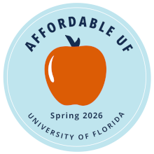

::: {.affordable-banner}
{.affordable-badge fig-alt="Affordable UF badge"}

My courses have been awarded an **Affordable UF** badge for materials
costing less than \$20 per credit hour.
:::

## Graduate

::: {.pub-entry}
[POS 6747 · Topics in Political Methodology (Linear Models)]{.pub-title}\
[Graduate. Spring 2026.]{.pub-venue}

[Graduate-level introduction to statistical modeling, with a focus on OLS regression. The course covers mechanics, inference, DAGs, bad controls, interactions, diagnostics, potential outcomes, matching, and panel / fixed-effects models.]{.pub-abstract}

::: {.pub-links}
[Syllabus (Spring 2026)](assets/syllabi/pos6747-linear-models-sp26.pdf)
:::
:::

::: {.pub-entry}
[POS 6737 · Political Data Analysis]{.pub-title}\
[Graduate. Most recently Fall 2025.]{.pub-venue}

[Graduate methods sequence: applied statistics, the linear regression framework, and reproducible workflows in R. Designed for incoming political science PhD students.]{.pub-abstract}

::: {.pub-links}
[Syllabus (Fall 2025)](assets/syllabi/pos6737-data-analysis-f25.pdf)
:::
:::

::: {.pub-entry}
[INR 6607 · International Relations Theory]{.pub-title}\
[Graduate. Most recently Fall 2024.]{.pub-venue}

[Graduate proseminar in IR theory: the major paradigms, debates, and contemporary research programs in the field.]{.pub-abstract}

::: {.pub-links}
[Syllabus (Fall 2024)](assets/syllabi/inr6607-ir-theory-f24.pdf)
:::
:::

::: {.pub-entry}
[Math Workshop for Political Science]{.pub-title}\
[Graduate. Pre-term refresher, Fall 2025.]{.pub-venue}

[A pre-term refresher covering notation, basic mathematics, linear algebra, calculus (differentiation, integration, optimization), and constrained optimization. Supplemented by Khan Academy and other video resources. Designed to prepare incoming political science graduate students for quantitative methods coursework.]{.pub-abstract}

::: {.pub-links}
[Syllabus (Fall 2025)](assets/syllabi/math-workshop-f25.pdf)
:::
:::

## Undergraduate

::: {.pub-entry}
[INR 4931 · Political Network Analysis]{.pub-title}\
[Undergraduate. Most recently Spring 2024.]{.pub-venue}

[Networks are ubiquitous in politics: countries are linked in trade and alliance networks, legislators are tied through co-sponsorship, rebel groups are connected by information flows. This course introduces network concepts and methods through political-science applications. No formal prerequisites, though prior data-analysis experience helps. Two weekly meetings combine conceptual instruction with applied work on real political data.]{.pub-abstract}

::: {.pub-links}
[Syllabus (Spring 2024)](assets/syllabi/inr4931-pol-network-sp24.pdf)
:::
:::

::: {.pub-entry}
[INR 4931 · International Networks]{.pub-title}\
[Undergraduate. Previously Fall 2019.]{.pub-venue}

[Undergraduate course examining international relations through the lens of network analysis: trade, alliance, conflict, and information networks among states and non-state actors.]{.pub-abstract}

::: {.pub-links}
[Syllabus (Fall 2019)](assets/syllabi/inr4931-ir-networks-f19.pdf)
:::
:::

::: {.pub-entry}
[POS 3780 · Data Visualization and Literacy]{.pub-title}\
[Undergraduate. Previously Fall 2017.]{.pub-venue}

[Tools and principles for data visualization and exploratory analysis in political science. Marries the substance of political theory to the methods of data visualization. No statistical background required — works as either a standalone course or a gateway to advanced data analytics.]{.pub-abstract}

::: {.pub-links}
[Syllabus (Fall 2017)](assets/syllabi/pos3780-data-viz-f17.pdf)
:::
:::
